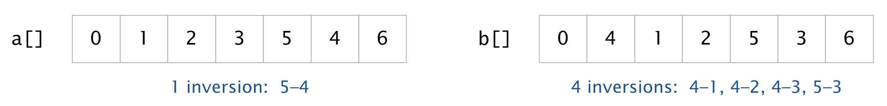

# Inversion Counter and Generator

## What This Program Does

This Java program helps analyze and create arrays by:
1. Counting inversions between arrays (measures how different they are)
2. Generating arrays with specific inversion counts

<p>
Generally, given an array of integers, a pair of elements <code>a[i]</code> and <code>a[j]</code> are <em>inverted</em> if <code>i < j</code> and <code>a[i] > a[j]</code>. For example, the array <code>a[]</code> has 1 inversion and
the array <code>b[]</code> has 4 inversions.

<p><blockquote>

</blockquote>


## Key Features

- **Count Inversions**: Measures how many pairs are in different order between arrays
- **Generate Rankings**: Creates arrays with exact numbers of inversions
- **Efficient Algorithms**: Runs quickly even for large numbers of entities

## How to Use

1. Compile the program:
   ```bash
   javac Inversions.java
   ```
2. Generate a ranking with specific inversions:
   ```bash
   java Inversions generate 10 20
   ```

## Examples

```bash
# Count inversions
$ java Inversions count 3,1,0,2
4 inversions

# Generate rankings
$ java Inversions generate 10 0
0 1 2 3 4 5 6 7 8 9

$ java Inversions generate 10 20
9 8 0 1 2 3 7 4 5 6
```

## How It Works

### Counting Inversions
- Compares all pairs of entities (i,j) where i comes before j
- Counts how many times the areay is reversed
- Runs in O(n²) time - works for up to 10,000+ entities

### Generating Rankings
- Builds array with exactly k inversions
- Uses a smart algorithm to place songs in optimal positions
- Runs in O(n) time - extremely fast even for large n

## Real-World Uses

- Music recommendation systems
- Voting analysis
- Ranking similarity comparisons
- Sports statistics
- Genome sequence analysis

## Limitations

- Maximum inversion count is n(n-1)/2 (completely reversed order)
- Input rankings must contain numbers 0 to n-1 exactly once
